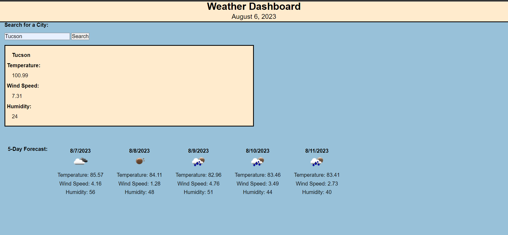

# 6-challenge

## Description 

- The purpose of this project was to be able to search a city and get both the current and the projected 5-day forecast. 

- I was tasked to start this project from scratch. Using the API openweathermap.org I was able to pull the data needed and display the data on the webpage using Javascript.

## License

Please refer to the license in the repo. 

## Link 

https://asoto225.github.io/6-challenge/

## Screenshot 

